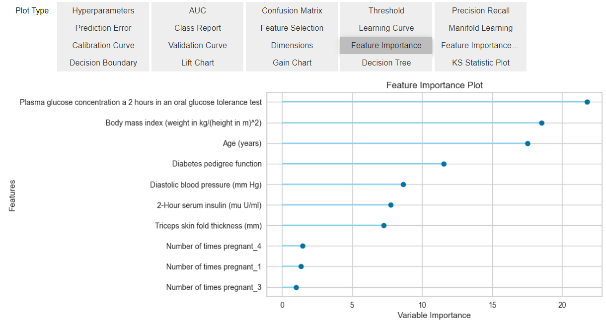

# PyCaret

* https://pycaret.gitbook.io/docs/

## Welcome to PyCaret

PyCaretは、機械学習のワークフローを自動化するPython製のオープンソース、ローコード機械学習ライブラリです。エンドツーエンドの機械学習・モデル管理ツールであり、実験サイクルを飛躍的に高速化し、生産性を向上させます。

他のオープンソースの機械学習ライブラリと比較して、PyCaretは数百行のコードを数行で置き換えることができる、代替のローコードライブラリです。これにより、実験が飛躍的に高速化・効率化されます。 PyCaretは基本的に、scikit-learn, XGBoost, LightGBM, CatBoost, spaCy, Optuna, Hyperopt, Rayなどの機械学習ライブラリやフレームワークのPythonラッパーとして使用されています。

PyCaretのデザインとシンプルさは、Gartner社が最初に使用した市民データサイエンティストという新しい役割に触発されたものです。市民データサイエンティストは、以前はより技術的な専門知識を必要とした簡単な分析タスクと適度に洗練された分析タスクの両方を実行できるパワーユーザーです。

## Features

PyCaretは、オープンソース、ローコードのPythonによる機械学習ライブラリで、ML実験における仮説から洞察までのサイクルタイムを短縮することを目的としています。 データサイエンティストは、エンドツーエンドの実験を迅速かつ効率的に実行することができます。他のオープンソース機械学習ライブラリと比較して、PyCaretは、わずか数行のコードで複雑な機械学習タスクを実行するために使用できる、代替のローコードライブラリです。PyCaret はシンプルで簡単に使用できます。

### PyCaret for Citizen Data Scientists

PyCaretのデザインとシンプルさは、Gartner社が最初に使用した市民データサイエンティストという新しい役割に触発されたものです。市民データサイエンティストは、以前はより専門的な知識を必要とした簡単な分析作業から中程度の高度な分析作業までこなすことができる「パワーユーザー」です。熟練したデータサイエンティストを見つけるのは難しく、雇用するのも高価になりがちですが、市民データサイエンティストはこのギャップを緩和し、ビジネス環境におけるデータサイエンスの課題に対処する効果的な方法となりえます。

### PyCaret deployment capabilities

PyCaretはPythonによるデプロイメント準備ライブラリで、ML実験で行われる全てのステップを再現可能なパイプラインを使用して再現し、生産性を保証することを意味します。パイプラインはバイナリファイル形式で保存でき、環境間で転送が可能です。

### PyCaret is seamlessly integrated with BI

PyCaretとその機械学習機能は、Microsoft Power BI、Tableau、Alteryx、KNIMEなど、Pythonをサポートする環境とシームレスに統合されています。これにより、これらのBIプラットフォームのユーザーは、既存のワークフローにPyCaretを統合し、簡単に機械学習のレイヤーを追加することができるようになり、非常に大きな力を発揮します。

### PyCaret is ideal for:

* 生産性を向上させたい経験豊富なデータサイエンティスト。
* ローコードの機械学習ソリューションを好む市民データサイエンティスト。
* 迅速なプロトタイプを構築したいデータサイエンス専門家。
* データサイエンスと機械学習の学生や愛好家。

### Time Series Module (beta)

PyCaretの新しい時系列モジュールがベータ版で利用可能になりました。PyCaretのシンプルさに忠実に、既存のAPIと一貫性を保ちつつ、機能をフルに搭載しています。統計テスト、モデルの学習と選択（30以上のアルゴリズム）、モデル分析、自動ハイパーパラメータチューニング、実験ロギング、クラウドへのデプロイメント、などなど。これらはすべて、わずか数行のコードで実現できます。試してみたい方は、公式のクイック・スタート・ノートブックをご覧ください。

このモジュールをベータ版でインストールするには:

```Terminal
pip install pycaret-ts-alpha
```

## Installation

### Install

PyCaret は以下の 64-bit システムでテストされ、サポートされています。

* Python 3.6 - 3.8
* Python 3.9 (Ubuntuのみ)
* Ubuntu 16.04以降
* Windows 7 またはそれ以降

PyCaret は Python の pip パッケージマネージャでインストールします。

```Terminal
pip install pycaret
```

フルバージョンをインストールする場合（下記の依存関係を参照）。

```Terminal
pip install pycaret[full]
```

もし、私たちのナイトリービルド（不安定版）を試したい場合は、pipからpycaret-nightlyをインストールすることができます。

```Terminal
pip install pycaret-nightly
```

### Environment

他のパッケージとの潜在的な競合を避けるため、python3 virtualenv (python3 virtualenv documentation 参照) や conda 環境などの仮想環境を使用することを強く推奨します。分離された環境を使用することで、特定のバージョンの pycaret とその依存関係を、以前にインストールした Python パッケージとは独立してインストールすることが可能になります。

```Python
# create a conda environment
conda create --name yourenvname python=3.8

# activate conda environment
conda activate yourenvname

# install pycaret
pip install pycaret

# create notebook kernel
python -m ipykernel install --user --name yourenvname --display-name "display-name"
```

> 参考
> `conda activatge yourenvname`で環境を切り替えることができる

PyCaret はまだ sklearn>=0.23.2 と互換性がありません。

### GPU

PyCaretを使用すると、GPU上でモデルを学習し、ワークフローを10倍高速化することができます。GPU上でモデルを学習させるには、setup関数でuse_gpu = Trueを渡すだけです。APIの使い方に変更はありませんが、デフォルトバージョンやフルバージョンではインストールされないため、場合によっては追加ライブラリのインストールが必要です。最新リリースでは，以下のモデルがGPUで学習可能です．

* エクストリームグラデーションブースティング(インストール不要)
* Catboost (インストール不要)
* Light Gradient Boosting Machine は GPU版 のインストールが必要です。
  * https://lightgbm.readthedocs.io/en/latest/GPU-Tutorial.html
* ロジスティック回帰、リッジ分類器、ランダムフォレスト、K近傍分類器、K近傍回帰器、サポートベクターマシン、線形回帰、リッジ回帰、ラッソー回帰はcuML >= 0.15が必要です。

### Dependencies

* pip install pycaret でインストールされるデフォルトの依存関係を以下に示します。
* pycaret[full]でインストールされるオプションの依存関係はここにリストアップされています。
* テスト要件はここにリストアップされています。

> 表は和訳では省略する。公式サイトを確認せよ

### Building from source

GitHubから直接パッケージをインストールする場合（最新のソース）には、以下のコマンドを使用します。

```Python
pip install git+https://github.com/pycaret/pycaret.git#egg=pycaret
```

プロジェクト名を明示するために #egg=pycaret の部分を含めることを忘れないでください。こうすることで、setup.py スクリプトを実行しなくても pip がメタデータを追跡できるようになります。

テスト実行:
テストスイートを起動するには、ソースディレクトリの外から次のコマンドを実行します。

```Python
pytest pycaret
```

### Docker

Docker はコンテナを使用して、PyCaret インストールをシステムの残りの部分から分離する仮想環境を作成します。PyCaret docker には Notebook 環境がプリインストールされており、ホストマシンとリソースを共有することができます（ディレクトリへのアクセス、GPU の使用、インターネットへの接続など）。PyCaret Docker イメージは、リリースごとにテストされています。

```Terminal
docker run -p 8888:8888 pycaret/slim
```

フルバージョンのDockerイメージの場合。

```Terminal
docker run -p 8888:8888 pycaret/full
```

詳しくは、こちらのドキュメントをご覧ください。

* https://hub.docker.com/r/pycaret/full

## Quickstart

### Classification

PyCaret の Classification モジュールは、要素をグループに分類するために使用される教師あり機械学習モジュールです。目標は、離散的で順序付けされていないカテゴリカルクラスラベルを予測することです。一般的な使用例としては、顧客のデフォルトの予測（Yes か No）、顧客の解約の予測（顧客が辞めるか留まるか）、発見された病気（陽性か陰性か）などがあります。このモジュールは、バイナリまたはマルチクラス問題に使用することができます。セットアップ機能により、モデリングするためのデータを準備する、いくつかの前処理機能を提供します。18以上のすぐに使えるアルゴリズムと，学習したモデルの性能を分析するためのいくつかのプロットを備えています．

**Setup**

この関数は学習環境を初期化し、変換パイプラインを作成します。Setup 関数は他の関数を実行する前に呼び出す必要があります．この関数は，data と target という2つの必須パラメータを受け取ります．その他のパラメータは任意です．

```Python
from pycaret.datasets import get_data
data = get_data('diabetes')
```


```Python
from pycaret.classification import *
s = setup(data, target = 'Class variable')
```


セットアップを実行すると、PyCaret の推論アルゴリズムが特定のプロパティに基づいてすべてのフィーチャーのデータ型を自動的に推論します。データ型は正しく推論されるはずですが、必ずしもそうなるとは限りません。これを処理するために、PyCaret はセットアップを実行すると、データ型の確認を求めるプロンプトを表示します。すべてのデータ型が正しい場合は Enter キーを、セットアップを終了する場合は quit と入力します。

PyCaret は、機械学習モデルに不可欠な複数のデータ型固有の前処理を自動的に実行するため、データ型が正しいかどうかを確認することは非常に重要です。

また、numeric_features と categorical_features パラメータを使用して、データ型を事前に定義することも可能です。


**Compare Models**

この関数は，モデルライブラリで利用可能な全ての推定量をクロスバリデーションにより学習し，その性能を評価する．この関数の出力は，クロスバリデーションによる平均スコアを含むスコアリンググリッドである．CV中に評価された指標は，get_metrics関数を用いてアクセスすることができる．また，add_metric関数とremove_metric関数を用いて，カスタムメトリクスの追加や削除が可能である．

> 過学習の検出には、get_metrics関数を使った焼きなまし法等が便利そうな気がする

```Python
best = compare_models()
```


```Python
print(best)
```


**Analyze Model**

テストセットに対する学習済みモデルのパフォーマンスを解析する機能です。場合によっては，モデルの再トレーニングが必要になることもあります．

```Python
evaluate_model(best)
```



evaluate_model は ipywidget を使っているので、Notebook でのみ使用可能です。また、plot_model関数を使用して、個別にプロットを生成することができます。

```Python
plot_model(best, plot = 'auc')
```


```Python
plot_model(best, plot = 'confusion_matrix')
```


**Predictions**

この関数は、学習済みモデルを用いて Label と Score（予測されるクラスの確率）列を予測する。データがNoneの場合は、テストセット（setup関数で作成）上でLabelとScoreを予測する。

```Python
predict_model(best)
```


評価指標はテストセットで計算される。2番目の出力は、テストセットでの予測値を含むpd.DataFrameです（最後の2列をご覧ください）。未見の（新しい）データセットに対するラベルを生成するには、predict_model関数にデータセットを渡すだけです。

```Python
predictions = predict_model(best, data=data)
predictions.head()
```


**Save the model**

```python
save_model(best, 'my_best_pipeline')
```

**To load the model back in environment**

```python
loaded_model = load_model('my_best_pipeline')
print(loaded_model)
```

### Regression

> リュウジおねがいします
> https://pycaret.gitbook.io/docs/get-started/quickstart#regression

### Clustering

> 小松お願いします
> https://pycaret.gitbook.io/docs/get-started/quickstart#clustering

### Anomaly Detection

> 滑川
> https://pycaret.gitbook.io/docs/get-started/quickstart#anomaly-detection

### Natural Language Processing

> リュウジお願いします
> https://pycaret.gitbook.io/docs/get-started/quickstart#natural-language-processing

### Association Rules Mining

> 小松お願いします
> https://pycaret.gitbook.io/docs/get-started/quickstart#association-rules-mining

### Time Series (beta)

> 滑川
> https://pycaret.gitbook.io/docs/get-started/quickstart#time-series-beta

## Tutorials

公式チュートリアルは次のページにあるリンクからNotebookを参照
* https://pycaret.gitbook.io/docs/get-started/tutorials

Videoチュートリアルはこちら
* https://pycaret.gitbook.io/docs/learn-pycaret/videos

### Binary Classification - Level Beginner

> https://github.com/pycaret/pycaret/blob/master/tutorials/Binary%20Classification%20Tutorial%20Level%20Beginner%20-%20%20CLF101.ipynb

### Binary Classification - Level Intermediate

> https://github.com/pycaret/pycaret/blob/master/tutorials/Binary%20Classification%20Tutorial%20Level%20Intermediate%20-%20CLF102.ipynb

### Multiclass Classification - Level Beginner

> https://github.com/pycaret/pycaret/blob/master/tutorials/Multiclass%20Classification%20Tutorial%20Level%20Beginner%20-%20MCLF101.ipynb

### Regression - Level Beginner

> https://github.com/pycaret/pycaret/blob/master/tutorials/Regression%20Tutorial%20Level%20Beginner%20-%20REG101.ipynb

### Regression - Level Intermediate

> https://github.com/pycaret/pycaret/blob/master/tutorials/Regression%20Tutorial%20Level%20Intermediate%20-%20REG102.ipynb

### Clustering - Level Beginner

> https://github.com/pycaret/pycaret/blob/master/tutorials/Clustering%20Tutorial%20Level%20Beginner%20-%20CLU101.ipynb

### Anomaly Detection - Level Beginner

> https://github.com/pycaret/pycaret/blob/master/tutorials/Anomaly%20Detection%20Tutorial%20Level%20Beginner%20-%20ANO101.ipynb

### Natural Language Processing - Level Beginner

> https://github.com/pycaret/pycaret/blob/master/tutorials/Natural%20Language%20Processing%20Tutorial%20Level%20Beginner%20-%20NLP101.ipynb

### Natural Language Processing - Level Intermediate

> https://github.com/pycaret/pycaret/blob/master/tutorials/Natural%20Language%20Processing%20Tutorial%20Level%20Intermediate%20-%20NLP102.ipynb

### Association Rules Mining - Level Beginner

> https://github.com/pycaret/pycaret/blob/master/tutorials/Association%20Rule%20Mining%20Tutorial%20-%20ARUL01.ipynb

### Time Series Forecasting - Level Beginner

> https://github.com/pycaret/pycaret/blob/time_series/time_series_101.ipynb

## Modules

* 後で担当割り振る
