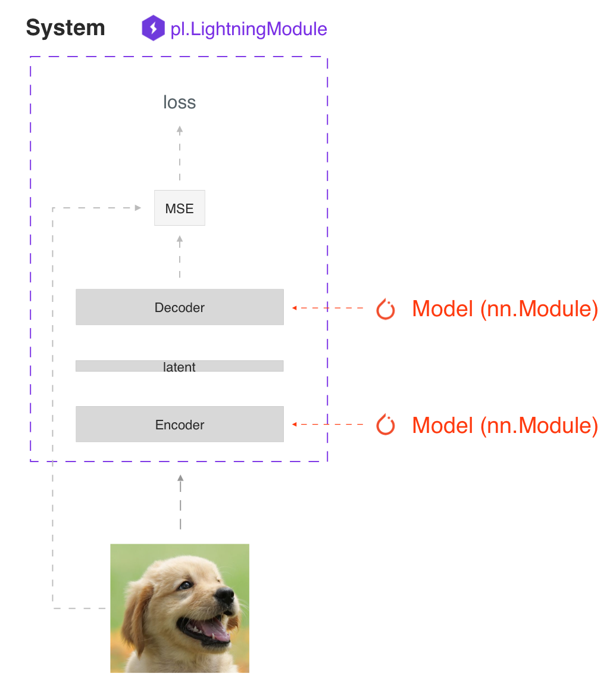

# Pytorch-Lightning

https://pytorch-lightning.readthedocs.io/en/stable/

## New to Lightning?

https://pytorch-lightning.readthedocs.io/en/stable/starter/introduction.html

2ステップでできるLightning

このガイドでは、2つのステップでPyTorchのコードをLightningに整理する方法を紹介します。

PyTorch Lightningでコードを整理することで、あなたのコードが生まれ変わります。

* 柔軟性はそのままに(これはすべて純粋なPyTorch)、定型的な部分を大幅に削減
* 研究コードをエンジニアリングから切り離すことで、より読みやすくなる
* 再現が容易
* 学習ループとトリッキーなエンジニアリングのほとんどを自動化することで、エラーが起こりにくくなる
* モデルを変更することなく、あらゆるハードウェアに拡張可能

---

### Step 0: Install PyTorch Lightning

pipを使用してインストールすることができます。

```python
pip install pytorch-lightning
```

またはcondaを使用します（condaのインストール方法はこちらをご覧ください）。

```python
conda install pytorch-lightning -c conda-forge
```

conda 環境を使用することもできます。

```python
conda activate my_env
pip install pytorch-lightning
```

---

以下をインポートしてください。

```python
import os
import torch
from torch import nn
import torch.nn.functional as F
from torchvision import transforms
from torchvision.datasets import MNIST
from torch.utils.data import DataLoader, random_split
import pytorch_lightning as pl
```

### Step 1: Define LightningModule

```python
class LitAutoEncoder(pl.LightningModule):
    def __init__(self):
        super().__init__()
        self.encoder = nn.Sequential(nn.Linear(28 * 28, 64), nn.ReLU(), nn.Linear(64, 3))
        self.decoder = nn.Sequential(nn.Linear(3, 64), nn.ReLU(), nn.Linear(64, 28 * 28))

    def forward(self, x):
        # in lightning, forward defines the prediction/inference actions
        embedding = self.encoder(x)
        return embedding

    def training_step(self, batch, batch_idx):
        # training_step defined the train loop.
        # It is independent of forward
        x, y = batch
        x = x.view(x.size(0), -1)
        z = self.encoder(x)
        x_hat = self.decoder(z)
        loss = F.mse_loss(x_hat, x)
        # Logging to TensorBoard by default
        self.log("train_loss", loss)
        return loss

    def configure_optimizers(self):
        optimizer = torch.optim.Adam(self.parameters(), lr=1e-3)
        return optimizer
```

システム vs モデル

Lightningモジュールは、モデルだけでなくシステムを定義します。



システムの例としては

* Autoencoder
* BERT
* DQN
* GAN
* Image classifier
* Semantic Segmentation
* and a lot more

LightningModuleはtorch.nn.Moduleと同じで、研究コードを1つのファイルにまとめ、自己完結させたものです。

* The Train loop
* The Validation loop
* The Test loop
* The Prediction loop
* The Model or system of Models
* The Optimizers and LR Schedulers

Hooksにある20以上のフックをオーバーライドすることで、トレーニングのあらゆる部分（バックワードパスなど）をカスタマイズすることができます。

```python
class LitAutoEncoder(pl.LightningModule):
    def backward(self, loss, optimizer, optimizer_idx):
        loss.backward()
```

FORWARDとTRAINING_STEPの比較

Lightningでは、学習と推論を分離することを推奨しています。training_stepは、完全なトレーニングループを定義します。ユーザーはforwardを使用して推論アクションを定義することをお勧めします。

例えば、この場合、オートエンコーダーを埋め込み抽出器として動作するように定義することができます。

```python
def forward(self, batch):
    embeddings = self.encoder(batch)
    return embeddings
```

もちろん、training_stepの中からforwardを使うことを妨げるものは何もありません。

```python
def training_step(self, batch, batch_idx):
    ...
    embeddings = self.encoder(batch)
    output = self.decoder(embeddings)
```

それは、あなたのアプリケーション次第です。ただし、両方の意図を分けて考えることをお勧めします。

* 推論(予測)にはforwardを使う。
* 学習にはtraining_stepを使用する。

詳しくはLightningModuleのドキュメントをご覧ください。

---

### Step 2: Fit with Lightning Trainer

まず、データを好きなように定義します。Lightningはtrain/val/test/predictの分割のためにDataLoaderが必要なだけです。

```python
dataset = MNIST(os.getcwd(), download=True, transform=transforms.ToTensor())
train_loader = DataLoader(dataset)
```

次に、LightningModuleとPyTorch Lightning Trainerをinitし、データとモデルの両方を用いてfitを呼び出します。

```python
# init model
autoencoder = LitAutoEncoder()

# most basic trainer, uses good defaults (auto-tensorboard, checkpoints, logs, and more)
# trainer = pl.Trainer(accelerator="gpu", devices=8) (if you have GPUs)
trainer = pl.Trainer()
trainer.fit(model=autoencoder, train_dataloaders=train_loader)
```

トレーナーは自動化する。

* エポックとバッチ・イテレーション
* optimizer.step()、loss.backward()、optimizer.zero_grad()の呼び出し
* model.eval()の呼び出し、評価中のgradの有効化/無効化
* チェックポイントの保存と読み込み
* Tensorboard (ロガーオプションを参照)
* マルチGPUサポート
* TPU
* 16ビット精度AMPのサポート

> Tip
> オプティマイザを手動で管理したい場合は、手動最適化モード（RL、GANなど）を使用することができます。

---

### 基本機能

手動と自動の比較

最適化

自動最適化

Lightningでは、training_step()メソッドからグラフを添付したロスを返せば、gradの有効/無効、バックワードパス、オプティマイザの更新のタイミングを気にする必要がなく、Lightningが最適化を自動で行ってくれます。

```python
def training_step(self, batch, batch_idx):
    loss = self.encoder(batch)
    return loss
```

手動による最適化

GANや強化学習、複数のオプティマイザや内部ループを使った研究などでは、自動最適化をオフにして、自分で完全にコントロールすることができます。

自動最適化をオフにして、自分で最適化をコントロールしましょう

```python
def __init__(self):
    self.automatic_optimization = False


def training_step(self, batch, batch_idx):
    # use_pl_optimizer=Falseでオプティマイザーにアクセスします。デフォルトはTrueで、use_pl_optimizer=Trueに設定すると、プラグイン/精度のサポートが維持されます
    opt_a, opt_b = self.optimizers(use_pl_optimizer=True)

    loss_a = self.generator(batch)
    opt_a.zero_grad()
    # 半精度などを自動化するために、`loss.backward`の代わりに `manual_backward()` を使用する...
    self.manual_backward(loss_a)
    opt_a.step()

    loss_b = self.discriminator(batch)
    opt_b.zero_grad()
    self.manual_backward(loss_b)
    opt_b.step()
```

ループのカスタマイズ

さらに柔軟性が必要な場合は、トレーニングループをコアにフルカスタマイズすることも可能です。これらは通常、高度なユースケースのためにカスタマイズする必要があります。詳しくはLoopsのドキュメントをご覧ください。

予測または展開

トレーニングが終了したら、LightningModuleを予測に使用するための3つのオプションがあります。

オプション1：サブモデル

システム内の任意のモデルを引き出して予測することができます。

```python
# ----------------------------------
# 埋め込み抽出器として使用する
# ----------------------------------
autoencoder = LitAutoEncoder.load_from_checkpoint("path/to/checkpoint_file.ckpt")
encoder_model = autoencoder.encoder
encoder_model.eval()

# ----------------------------------
# イメージジェネレータとして使用するため
# ----------------------------------
decoder_model = autoencoder.decoder
decoder_model.eval()
```

オプション2：フォワード

また、フォワードメソッドを追加することで、好きなように予測を行うことができます。

```python
# ----------------------------------
# AEによるエンベッディングの抽出
# ----------------------------------
class LitAutoEncoder(LightningModule):
    def __init__(self):
        super().__init__()
        self.encoder = nn.Sequential(nn.Linear(28 * 28, 64))

    def forward(self, x):
        embedding = self.encoder(x)
        return embedding


autoencoder = LitAutoEncoder()
embedding = autoencoder(torch.rand(1, 28 * 28))
```

```python
# -------------------------------
# AEを使った画像生成
# -------------------------------
class LitAutoEncoder(LightningModule):
    def __init__(self):
        super().__init__()
        self.decoder = nn.Sequential(nn.Linear(64, 28 * 28))

    def forward(self):
        z = torch.rand(1, 64)
        image = self.decoder(z)
        image = image.view(1, 1, 28, 28)
        return image


autoencoder = LitAutoEncoder()
image_sample = autoencoder()
```

オプション3：プロダクション

本番システムでは、ONNXやTorchScriptの方がはるかに高速です。フォワードメソッドを追加しているか、必要なサブモデルだけをトレースしているか確認してください。

to_torchscript()メソッドを使用したTorchScriptです。

```python
autoencoder = LitAutoEncoder()
autoencoder.to_torchscript(file_path="model.pt")
```

o_onnx()メソッドでOnnxする。

```python
autoencoder = LitAutoEncoder()
input_sample = torch.randn((1, 28 * 28))
autoencoder.to_onnx(file_path="model.onnx", input_sample=input_sample, export_params=True)
```

アクセラレータの使用

LightningでCPU、GPU、TPU、IPUを使うのは簡単です。コードを変更する必要はなく、Trainerのオプションを変更するだけです。

CPU

```python
# train on CPU
trainer = Trainer()

# train on 8 CPUs
trainer = Trainer(accelerator="cpu", devices=8)

# train on 1024 CPUs across 128 machines
trainer = pl.Trainer(accelerator="cpu", devices=8, num_nodes=128)
```

GPU

```python
# train on 1 GPU
trainer = pl.Trainer(accelerator="gpu", devices=1)

# train on multiple GPUs across nodes (32 GPUs here)
trainer = pl.Trainer(accelerator="gpu", devices=4, num_nodes=8)

# train on gpu 1, 3, 5 (3 GPUs total)
trainer = pl.Trainer(accelerator="gpu", devices=[1, 3, 5])

# Multi GPU with mixed precision
trainer = pl.Trainer(accelerator="gpu", devices=2, precision=16)
```

TPU

```python
# Train on 8 TPU cores
trainer = pl.Trainer(accelerator="tpu", devices=8)

# Train on single TPU core
trainer = pl.Trainer(accelerator="tpu", devices=1)

# Train on 7th TPU core
trainer = pl.Trainer(accelerator="tpu", devices=[7])

# without changing a SINGLE line of your code, you can
# train on TPUs using 16-bit precision
# using only half the training data and checking validation every quarter of a training epoch
trainer = pl.Trainer(accelerator="tpu", devices=8, precision=16, limit_train_batches=0.5, val_check_interval=0.25)
```

IPU

```python
# Train on IPUs
trainer = pl.Trainer(accelerator="ipu", devices=8)
```

チェックポイント

Lightningは自動的にモデルを保存します。学習が完了したら、以下のようにチェックポイントをロードすることができます。

```python
model = LitModel.load_from_checkpoint(path_to_saved_checkpoint)
```

上記のチェックポイントには、モデルを init し、state dict を設定するために必要なすべての引数が含まれています。もし手動で行いたいのであれば、以下がそれに相当します。

```python
# load the ckpt
ckpt = torch.load("path/to/checkpoint.ckpt")

# equivalent to the above
model = LitModel()
model.load_state_dict(ckpt["state_dict"])
```

詳しくは、Checkpointのドキュメントをご覧ください。

データフロー

各ループ（training, validation, test, predict）には、実装可能な3つのフックがあります。

* x_step
* x_step_end(optional)
* x_epoch_end(optional)

```Python
outs = []
for batch in data:
    out = training_step(batch)
    out = training_step_end(out)
    outs.append(out)
training_epoch_end(outs)
```

Lightningに相当するのは

```python
def training_step(self, batch, batch_idx):
    prediction = ...
    return prediction


def training_epoch_end(self, outs):
    for out in outs:
        ...
```

DPまたはDDP2の分散モード（デバイス間でバッチを分割する）を使用する場合は、こちらの「Training with DataParallel」セクションをご覧ください。検証ループ、テストループ、予測ループは同じ構造になっています。

---

### オプションの拡張機能

MLパイプラインをより堅牢にするためのオプション拡張を以下に紹介します。

* LightningDataModule
* Callbacks
* Logging
* Accelerators
* Plugins
* Loops

---

### Debugging

Lightningには、デバッグのためのツールがたくさんあります。ここでは、そのうちのいくつかを例として紹介します。

Limit Batches

```python
# 1エポックあたり10個の学習バッチと3個の評価バッチのみを使用する
trainer = Trainer(limit_train_batches=10, limit_val_batches=3)
# 1エポックあたり総トレーニングバッチの20%と総バルブバッチの10%を使用する
trainer = Trainer(limit_train_batches=0.2, limit_val_batches=0.1)
```

Overfit Batches

```python
# 同じバッチを自動的にモデルにオーバーフィットさせ、サニティテストを行うことができます。
# 10トレインバッチのみ使用
trainer = Trainer(overfit_batches=10)
# 全トレインバッチの20％しか使用しない
trainer = Trainer(overfit_batches=0.2)
```

Fast Dev Run

```python
# すべてのコードをユニットテストする - コードのすべての行を一度ヒットして、バグがあるかどうかを確認します。
# 何時間も待つことなく、どこかにクラッシュする
trainer = Trainer(fast_dev_run=True)

# すべてのコードをユニットテストする - 4つのバッチでコードのすべての行をヒットする
trainer = Trainer(fast_dev_run=4)
```

Val Check Interval

```python
# トレーニングエポックの25%ごとに検証を実行する
trainer = Trainer(val_check_interval=0.25)
```

```python
# コードのプロファイリングにより、スピードやメモリのボトルネックを見つけることができます。
Trainer(profiler="simple")
```

---

### Other Cool Features

最初のライトニングモデルを定義してトレーニングしたら、次のような他のクールな機能を試してみるのもいいかもしれません。

* 自動的な早期停止
* 自動的な切り捨てバックプロパゲーション-スルータイム
* バッチサイズの自動調整
* バッチサイズの自動調整
* S3から直接チェックポイントをロード
* 大規模な計算クラスタへのスケールアップ
* 訓練/評価/テスト/予測ループごとに複数のデータローダを使用する
* 複数のオプティマイザを使用して強化学習やGANを行うことができます。

ステップバイステップのウォークスルーでもっと学ぶために私たちのガイドをお読みください。

---

### Starter Templates

何かをインストールする前に、以下のテンプレートを使って、ライブで試してみてください。

スクラッチモデル
<https://colab.research.google.com/drive/1rHBxrtopwtF8iLpmC_e7yl3TeDGrseJL?usp=sharing%3E>

スクラッチモデルと手動最適化
<https://colab.research.google.com/drive/1nGtvBFirIvtNQdppe2xBes6aJnZMjvl8?usp=sharing>

### Grid AI

Grid AIは、クラウド上で大規模な学習とチューニングを行うためのネイティブソリューションです。

GitHubまたはGoogleアカウントをお持ちの方は、こちらから無料でご利用いただけます。
<https://www.grid.ai/>

---

### Community

コアメンテナーと数千人の専門研究者からなる私たちのコミュニティは、SlackやGitHub Discussionsで活発に活動しています。ライトニングに関する質問や、研究についての議論にぜひご参加ください。

---

### Masterclass

また、Lightningの高度な使い方を学べるマスタークラスも開催しています。

---

## INSTALLATION

省略
<https://pytorch-lightning.readthedocs.io/en/stable/starter/installation.html>

---

## HOW TO ORGANIZE PYTORCH INTO LIGHTNING

<https://pytorch-lightning.readthedocs.io/en/stable/starter/converting.html>
